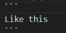

# Markdown
마크업 랭귀지, 텍스트로 문서 작성하는 간단한 방법으로  
텍스트와 코드를 문서화하기 위해 사용한다.

## Markdown 문법
### 1. 제목
- #을 사용하면 제목으로 표현할 수 있다.
- #의 갯수에 따라 제목 1~3을 나눌 수 있다.
    ``` 
    # 제목1 (제일 큰 제목)
    ## 제목2 (두 번째로 큰 제목)
    ### 제목3 (세 번째로 큰 제목)
    ```
 - 하위 제목들을 더 만들 수 있지만 보통 제목3까지만 사용한다.  
    프로그램에 따라 제목 3까지만 인식하는 경우가 있기 때문이다.


### 2. 리스트
```
1. 숫자 리스트
- 숫자 없는 리스트
    - 숫자 없는 하위 리스트
```
- 숫자 리스트 : 숫자와 점을 붙여서 입력하고 스페이스바 누르기
- 숫자 없는 리스트 : 바(-) 넣고 스페이스바 누르기
    - 숫자 없는 하위 리스트  
    : 기존 글이나 리스트 위치보다 들여쓴 후 숫자 없는 리스트와 동일하게 바(-) 넣고 스페이스바 누르기


### 3. 구분선
```
---
```
- 바(-)를 3개 연이어 쓴 후 엔터치기

### 4. Code Block
- 코드를 코드처럼 표현하는 방법
- 백틱(`) 3개를 코드의 위아랫 줄에 넣어주기
    - 백틱(`)은 자판의 상단 숫자 1옆 맨 왼쪽 혹은 왼쪽 Tab키 위쪽에 있다.  

```
Like this
```


### 5. 링크 & 이미지 삽입
- **[링크 보이는 모습](링크 경로)**  
    ```
    [google](https://google.com)
    ```
    [google](https://google.com)
- **![이미지 보이는 모습] (이미지 경로)**
    - 이미지 삽입은 맨앞에 **느낌표(!)**를 넣어줘야 한다.
    ```
    
    ```
    
    - 이미지 경로의 경우 링크를 넣어줄 수도 있고 컴퓨터 내부의 파일을 넣어줄 수도 있다.  
    -> 컴퓨터 내부의 파일을 넣어줄 경우 경로를 정확히 입력하여야 한다.
    ```
    
    ```
      
    -> 이 경우는 저장한 이미지를 해당 마크다운과 같은 위치에 있어서 파일명만 입력해도 정상 출력이 되었다.  
    만약 다른 위치에 있다면 경로를 입력해주어야 한다.  
    경로가 복잡하거나 이미지의 위치가 변경되었다면 수정이 번거로우니 같은 위치에서 관리하거나 링크로 삽입하는 것이 편할 것 같다.

- **링크는 절대 경로이고, 로컬에 있는 이미지를 경로로 넣을 때는 상대경로이다.**
    - **절대 경로** : 바뀌지 않는 주소
    - **상대 경로** : 현위치에 따라 바뀌는 경로
        - 예시  
        절대 경로 : 마크다운 건물 203호  
        상대 경로 :  
            - 내가 현재 202호에 있는 경우 203호는 옆이다.
            - 내가 현재 103호에 있는 경우 203호는 위이다.

### 6. 텍스트 관련
- **줄바꿈**
    - 하기 전 줄의 끝에서 스페이스바 2번 누르고 엔터  
    다음 줄에 내용 작성하면 줄 바꿈되어서 표현됨
- **굵게 표시(Bold)**
    - 굵게 표시하고 싶은 부분의 앞 뒤에 별표(*)를 2개씩 넣어준다.
    ```
    **Bold**
    ```  
- **기울임**
    - 기울이고 싶은 부분의 앞 뒤에 별표(*) 1개씩 넣어준다.  
    ```
    *기울이기*
    ```
- **취소선**
    - 취소선을 넣고 싶은 부분의 앞 뒤에 물결(~) 2개씩 넣어준다.
    ```
    ~~취소선~~
    ```
